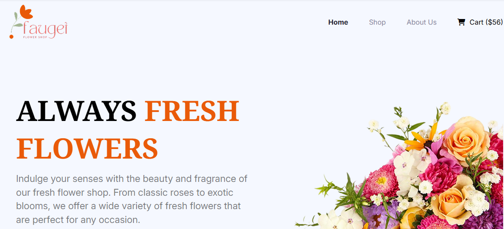

# 🌷 Faugei

*Welcome to ***Faugei***, a beautifully crafted, clean and responsive flower shop website designed to showcase fresh flowers, indoor plants, and exclusive floral deals for every occasion.

*

## 📌 About This Project

**Faugei** is a modern and responsive flower shop website designed to showcase a wide range of fresh flowers and plants. It offers users a smooth browsing experience to explore floral collections, seasonal deals, and helpful plant care information.

---

## 💻 Features

- Clean and modern UI/UX
- Beautiful and responsive flower shop design
- Fully built using HTML, CSS, and Tailwind CSS
- Interactive hover effects for images and icons 
- Footer with social links and navigation

---

## 🛠️ Technologies Used

- HTML  
- CSS
- Tailwind CSS
- Google Fonts CDN  
- Font Awesome Icons CDN

---

## 🌐 Live Website

👉 [Click here to visit the website](https://ifthe16.github.io/b12-assignment-02/)

